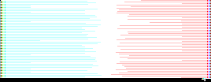
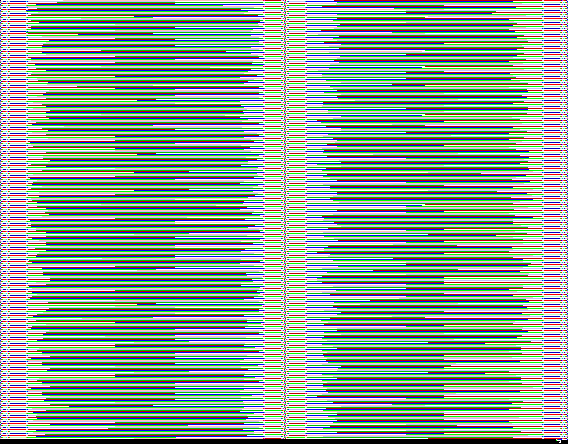

# :=

This repository contains **The Top-level Walruses** team's submission for the [10th Python Discord Code Jam](https://www.pythondiscord.com/events/code-jams/10/).

## Secret codes

The theme of the code jam was **secret codes**.
We decided to create a program that can encode and decode secret messages (or even *code*) into images, using a *secret code* for a Vigenère cipher.
But wait, they're not just any images, they're [Piet](https://www.dangermouse.net/esoteric/piet.html) programs!
Piet is an esoteric programming language that uses changes in color to represent instructions.
When executed with the correct key as input, the Piet program will output the encoded message.

## Usage

### Setting up

This project was built and tested with Python 3.11.

To get started, run the commands below in your terminal:

```sh
# Clone the repository and change into the project directory.
git clone https://github.com/lemonyte/the-top-level-walruses.git
cd the-top-level-walruses

# Create a virtual environment and activate it.
python -m venv .venv
# PowerShell or Command Prompt.
.\.venv\Scripts\activate
# Bash or other Linux shell.
source ./.venv/bin/activate

# Install project dependencies.
pip install -r requirements.txt
```

### Generating an image

Use the `generate` command to generate an image. The command can take input data either as a string or a path to a file.

```sh
python -m piet generate "My super secret message!" out.png
```

This will generate an image that looks like this:


Besides input and output paths, the command also accepts the following options:

- `--cols <int>`: Override the number of columns in the output image, by default the generator will automatically determine the best number of columns.
- `--recurse <int>`: Generate images recursively, by default this is disabled. [More on this](#recursive-encoding) later.
- `--input <string>`: Input to pass to the interpreter, used as a cipher shift. [More on this](#encrypting-with-a-key) later as well.
- `--step-limit <int>`: Limit the number of steps the interpreter can take, by default this is 1 million. This is useful to prevent infinite loops.
- `--debug`: Enable debug mode, which will print out the state of the interpreter after each step.

### Interpreting an image

Running your newly generated image is pretty straightforward:

```sh
python -m piet run out.png
```

This command has the same `--input`, `--step-limit` and `--debug` options as the `generate` command.
Additionally, the `--execute` flag will try to execute the content of the image as Python code.

### Encrypting with a key

By passing a string to the `--input` option, you can encrypt your message with a key.

```sh
python -m piet generate "My super secret message!" out.png --input "my secret key"
```

Using a Vigenère cipher, the bytes in the input data will be shifted by the bytes in the key before being encoded into the image.
The catch is the reverse operation is encoded in the image as well, so you must pass the same key to the interpreter to decrypt the message.
If run without a key, the interpreter will fail to execute the program.

### Recursive encoding

If you pass `--recurse` a value greater than 0, the generator will recursively generate an image for the input data, then use that image as the input data for the next image.

> Note: be careful when using this option, as the size of the image and the time it takes to generate will grow very quickly.

```sh
python -m piet generate "My super secret message!" out.png --recurse 3
```

To use keys with recursive encoding, you must pass multiple keys by specifying the `--input` option multiple times. If the number of keys is less than the number of recursions, remaining recursions will not be encrypted.

```sh
python -m piet generate "My super secret message!" out.png --recurse 3 --input "key1" --input "key2" --input "key3"
```

This will generate a substantially larger image:


To decrypt a recursively encoded image, you must run the images sequentially using same keys that were used in the generation process *in reverse order*.
This is because the first key was used to encrypt the innermost image, and the last key was used to encrypt the outermost image.

Due to a technical limitation, each nested image is also wrapped in a snippet of Python code that simply decodes the image from base64 and saves it.
To skip the step of saving and running the wrapper code, you can pass the `--execute` flag to the interpreter.

> Note: by default the wrapper code will write to a file named `out.png`.
> If this is undesirable, you can save the wrapper code to a file by passing an output path and not using the `--execute` flag, then edit the file path in the wrapper code and run it manually.

```sh
python -m piet run out.png --input "key3" --execute
python -m piet run out.png --input "key2" --execute
python -m piet run out.png --input "key1"
```

## Technical

We used Pillow for reading and writing image files, and a custom list subclass to store the color data as tuples of RGB values.
We opted not to use numpy arrays because it was more work to resize the arrays dynamically than to use a list.

### Common

This module simply contains common classes and constants used by the other modules, like the `Color` named tuple and the `SelfExpandingList` class.

### Reader

Interpreting an image starts with the reader module.
The `ImageReader` class is responsible for converting an input image into a two-dimensional list of `Color` objects, and analyzing the image to determine information about codels and color blocks.

### Runtime

The runtime module contains the classes that simulate Piet's behavior, including the stack, direction pointer, and codel chooser.
A `PietRuntime` object keeps track of the state of the stack, pointer, and codel chooser, and provides methods to manipulate them.
It also provides the binary input and output interfaces.

### Interpreter

The `PietInterpreter` class contains the logic for executing a Piet program.
It exposes the methods `run` to run the program, and `step` to execute a single step in the execution loop.

### Generator

The `ImageGenerator` class is responsible for generating an image from input data.
It has methods for setting specific locations in the image to specific commands, and setting the next command in the path of the interpreter's execution.
Internally, it uses the interpreter to run the program as it is being generated, to determine the position of the next command.
It also has a method for generating an image recursively up to a specified depth.
Once the generated image is complete, the colors are inserted into an Pillow `Image` object and returned.

### CLI

This module provides a command-line interface for the generator and interpreter.

## Known issues

A number of issues are present in this project, as we didn't have enough time to properly investigate and fix them.

- The interpreter does not support scaled images, and does not have an option to specify codel size.
- Extremely large input data will cause a RecursionError.
- Using arbitrary binary data as input data will in some cases cause the generator to create an incomplete image, making decoding impossible. This can be worked around using base64, but that negates the benefit of compression.
- Adding zlib compression breaks the project due to the above issue.

## Development

Follow the steps in the [Setting up](#setting-up) section, then:

```sh
# Install development dependencies.
pip install -r requirements-dev.txt

# Set up pre-commit hooks.
pre-commit install
```

Run the tests by simply invoking pytest:

```sh
pytest
```

## Credits

The [Piet](https://www.dangermouse.net/esoteric/piet.html) language was created by David Morgan-Mar.

Team contributions:

- Interpreter and runtime: [Noah Tanner](https://github.com/kevinshome)
- Image generator and CLI: [Lemonyte](https://github.com/lemonyte)
- Image reader: [Dayshaun Lee](https://github.com/dayshaunlee)
- Web interface: [aditheawesome](https://github.com/aditheawesome) & [Dreadrook](https://github.com/Dreadrook)

## License

[MIT License](LICENSE)

## Gallery

For those of you who just want to admire the code art a little more, here is a collection of images generated by our program.
Decrypting them is left as an exercise for the reader.
Can you solve the puzzle? 😉

### key.png

It's a key... but for what?

Generally, images encoded without a key will look more uniform, with large white areas and less distinct colors.



### piet.png

This one looks a little different because of the encryption cipher shifting the byte values.

<details>
<summary>Key hint</summary>
Surname.
</details>


### key2.png

It's gotta be called "key" for a reason, right?


### generator.png

That filename sounds familiar... what an interesting color pattern!

<details>
<summary>Key hint</summary>
What is the name of the first parameter of an instance method?
</details>


### key3.png

I think you get the idea by now.
This one looks a bit bigger than the other two...


### zen.png

So beautiful... I could stare at it for hours.

<details>
<summary>Key hint</summary>
What do you import to get the Zen of Python?
</details>



### secret.png

This is a rather big one, I wonder what could be inside...

<details>
<summary>Key hint</summary>
The keys are hidden in plain sight.
</details>


