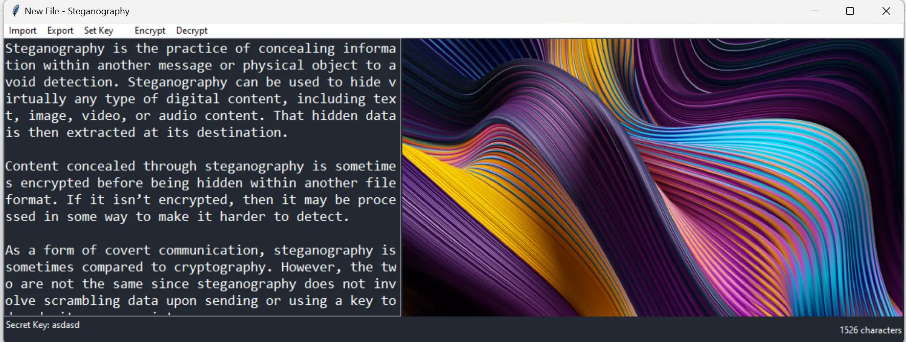

# The Neverending Loops

Python Discord Code Jam Repository For The Neverending Loops

## Table of Contents

1. [About The Project](#about-the-project)
    - [Made With](#made-with)
    - [Features](#features)
2. [Getting Started](#getting-started)
    - [Requirements](#requirements)
    - [Installation](#installation)
3. [Screenshots](#screenshots)
4. [License](#license)
5. [Contributors](#contributors)

## About The Project

### Made With

This project was made with Python’s PIL library for image processing and numpy for image manipulation.

### Features

- Typing Colors

    Typing Colors is a

- Steganography

    We also have a steganography


## Getting Started

### Requirements

- [Python 3](https://www.python.org/downloads/)
- [Pillow](https://pypi.org/project/Pillow/)
- [Numpy](https://pypi.org/project/numpy/)

### Installation

```bash
git clone https://github.com/inkontoasty/the-neverending-loops
cd the-neverending-loops
pip install -r requirements.txt
python src/main.py
```

# Screenshots





## License

This repository is licensed under the MIT license, which you can find in the LICENSE file.

## Contributors

- [inkontoasty](https://github.com/inkontoasty)
- [thisismudith](https://github.com/thisismudith)
- [13_hh](https://github.com/hH-13)
- [0xkarambit](https://github.com/HarshitJoshi9152)
- [_rowhan_](https://github.com/rowhan1111)

> [Discord server used for the code jam](https://discord.gg/Q8QBreaRh8)
