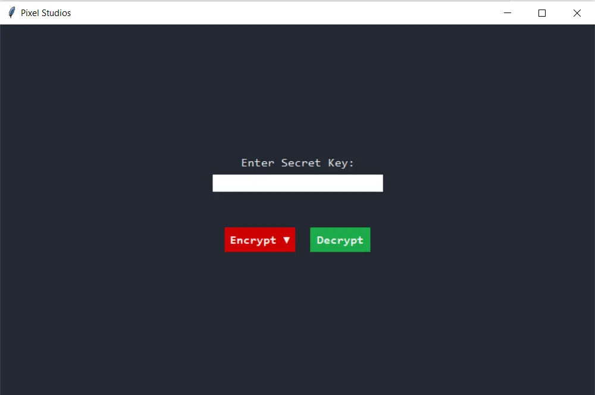
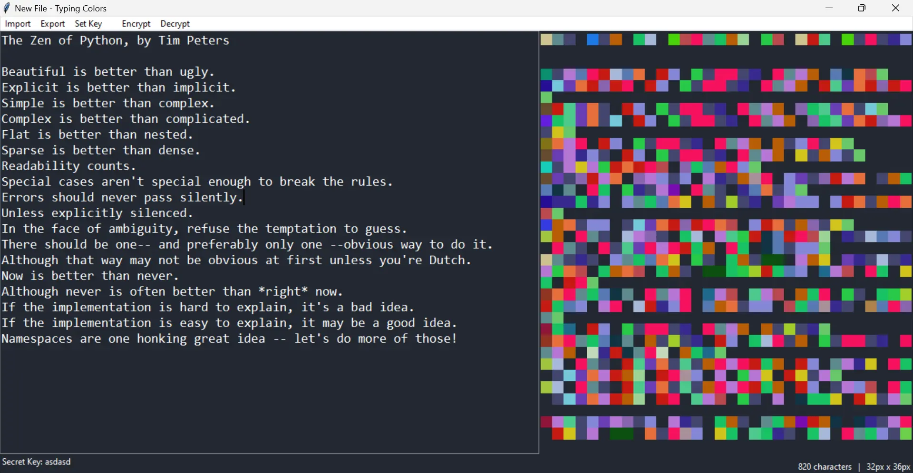
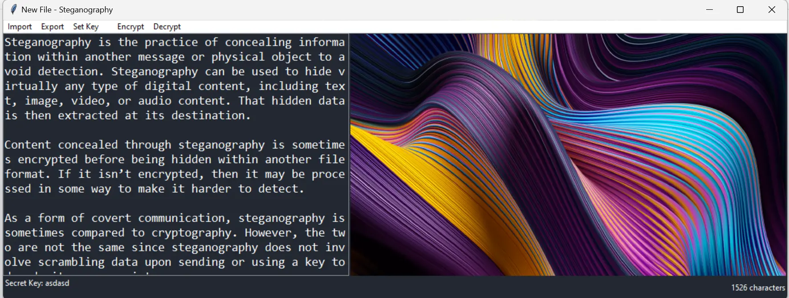
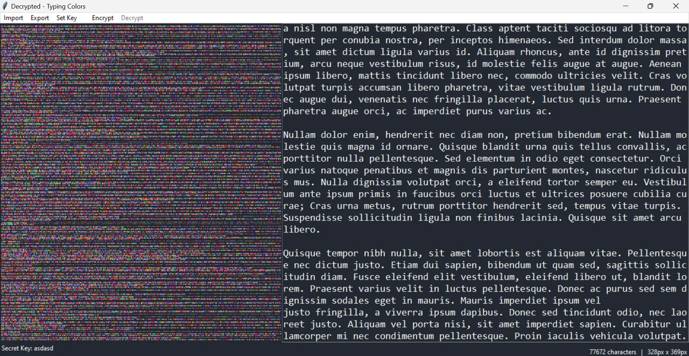
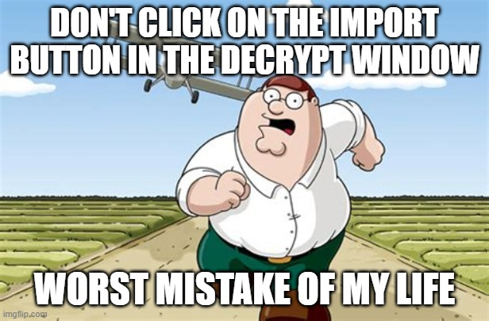
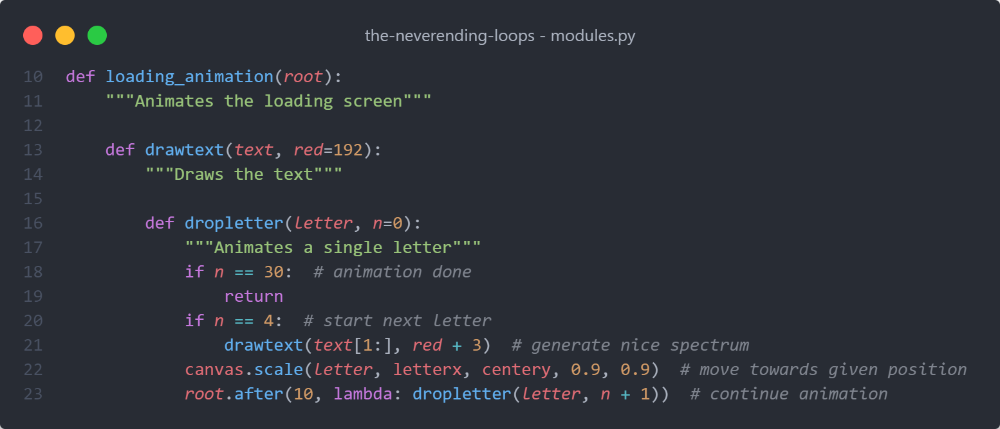
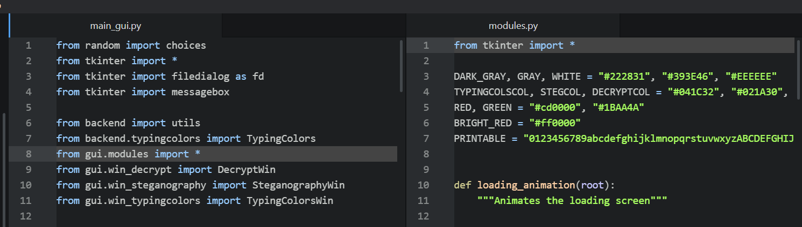
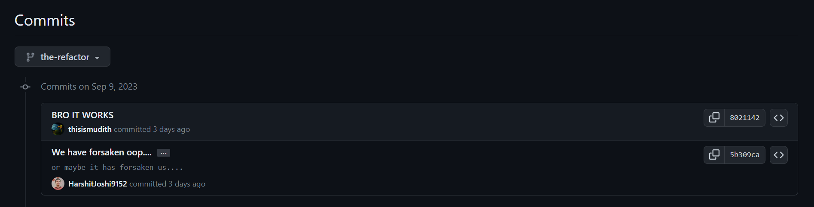
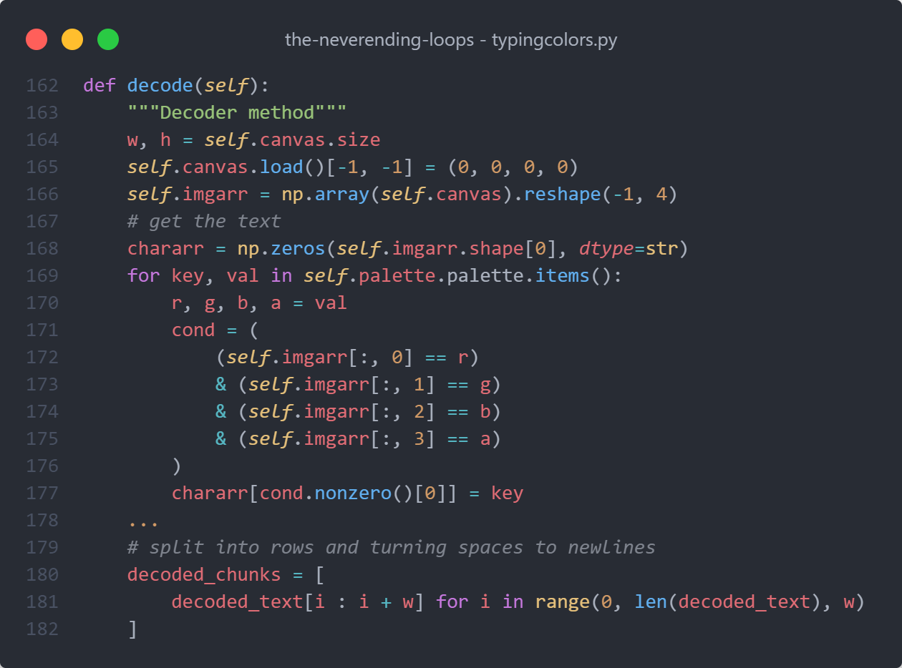

# The Never-Ending Loops

Our loop-less (incomparable) repository for the [10th Python Discord Code Jam](https://www.pythondiscord.com/events/code-jams/10)

<details>
<summary>Table of Contents</summary>

1. [About The Project](#about-the-project)
    - [What We Made](#what-we-made)
    - [Made With](#made-with)
    - [Project Structure](#project-structure)
2. [Features](#features)
    - [Typing Colors](#typing-colors)
    - [Steganography](#steganography)
    - [Decryption](#decryption)
3. [Getting Started](#getting-started)
    - [Requirements](#requirements)
    - [Installation](#installation)
4. [Usage](#usage)
    - [The video](#the-video)
    - [Snapshots](#snapshots)
5. [License](#license)
6. [Contributors](#contributors)
7. [Extras](#extras)
    - [Stuff that went wrong, Stuff… (Behind The Codes)](#stuff-that-went-wrong-stuff-behind-the-codes)
    - [Mind waving us a Hi on our Discord?](#mind-waving-us-a-hi-on-our-discord)

</details>

## About The Project

### What We Made

The project focuses on the idea of secret codes in the form of an image. The project utilizes two modes to encrypt the message, **Typing Colors** and **Steganography**, based upon a unique secret key. Navigate to the [Features](#features) section for a detailed description. The project also provides a method to decrypt the encrypted images to find the hidden message through the decrypt button.

### Made With

- Pillow
- NumPy
- Tkinter
- Love ❤️

**Guess what?** From the backend, to the frontend, our project is completely developed in **Python 3**.

### Project Structure

```
src/                     - all our source code
  backend/               - source code for the backend
    typingcolors.py      - typing colors backend for GUI
    steganography.py     - steganography backend for GUI
    utils.py             - decryption & palette for typing colors
  gui/                   - source code for the GUI
    main_gui.py          - main window and home page
    modules.py           - loading screen, menubars and colors
    win_typingcolors.py  - frame for encrypting typing colors
    win_steganography.py - frame for encrypting steganography
    win_decrypt.py       - frame for decrypting
  main.py                - runs the application
```


## Features

The whole application is solely reliable on **symmetrical secret keys** (same key for encryption and decryption) making it **secure**, **user-friendly** and **fun to use**.

### Typing Colors

A mode wherein users can convert their input text into an image consisting of colored pixels.
**Here’s the best part:** Each character has its unique RGB color. The colors are generated based on a unique secret key entered by the user at the start of the application.

<details>
<summary> <b>Detailed Explanation</b> </summary>

   The user interface reads the user’s input entered in the input box (on the left) and displays the respective encoded/color image on the right. You can also import your own text file to use as the input text.

   **How does the encryption work?** Firstly, the final/latest user input compared with the initial/previous input to check for any modification. if there’s a modification, for every character that has been added/deleted, a unique RGBA color is assigned to it that is generated as per the secret key.

   For each character, a corresponding pixel is created with the color for that specific character. Decrypting the image is **impossible** without the secret key.
</details>


### Steganography

Going by its name, steganography is a mode which users can hide their input text behind an image provided by them.
**Here’s the best part:** The original image and the encrypted image don’t have a noticeable change, making it impossible to know beforehand whether the image has been encrypted or not just by looking at the image. To decode the image, a unique secret key is required.

<details>
<summary> <b>Detailed Explanation</b> </summary>

   The user is asked to select an image file that would be used as a mask (text would be hidden behind it) and they can import a different mask image if they would like to change it later. Next, a window would open, where the user can type the text they want to be hidden behind the image.

   Upon exporting the image, the text gets encrypted with the secret key and the pixels in the mask would be seamlessly modified to store the encrypted text.

   There’s also a bonus CLI for this feature, which you can use by running `src/backend/steganography.py`
</details>


### Decryption

This mode allows the user to decrypt the images generated via the encryption modes above **Typing Colors and Steganography** and obtain the hidden message based on the unique secret key.
**Here’s the best part:** This mode is capable of decrypting the images generated from different modes simultaneously without having to specify the mode with which the image was encrypted.

<details>
<summary> <b>Detailed Explanation</b> </summary>
   Upon exporting an image in one of the encryption modes, a specific bit in the last pixel gets modified, helping the decryption mode identify which method was used to encrypt the image.

   When you select an image to decrypt, the program takes that bit in the last pixel to identify the encryption method used for the image and call the corresponding decryption algorithm.
</details>

## Getting Started

### Requirements

- [Python 3](https://www.python.org/downloads/)
- [Pillow](https://pypi.org/project/Pillow/)
- [NumPy](https://pypi.org/project/numpy/)

### Installation

```bash
git clone https://github.com/inkontoasty/the-neverending-loops
cd the-neverending-loops
pip install -r requirements.txt
python src/main.py
```


## Usage

### The Video

[Click here](https://clipchamp.com/watch/YECnlkwoGGp?utm_source=share&utm_medium=social&utm_campaign=watch)

### Snapshots



The Start Menu (Main Page)



Encryption - Typing Colors



Encryption - Steganography



Decryption - Typing Colors


## License

This repository is licensed under the MIT license, which you can find in the LICENSE file.


## Contributors

- [inkontoasty](https://github.com/inkontoasty)
- [thisismudith](https://github.com/thisismudith)
- [13_hh](https://github.com/hH-13)
- [0xkarambit](https://github.com/HarshitJoshi9152)
- [_rowhan_](https://github.com/rowhan1111)


## Extras

### Stuff that went wrong, Stuff… (Behind The Codes)

- Don’t press the import button on the decrypt page. Or do, it won’t crash, promise✨

    

- “Flat is better than nested.”

    

- “Namespaces are one honking great idea — let's do more of those!”

    

- “Don't comment bad code, rewrite it. — went wrong.”

    

- “If it works, don’t touch it. — flawless code”

    


### [**Mind waving us a Hi on our Discord?**](https://discord.gg/Q8QBreaRh8)
